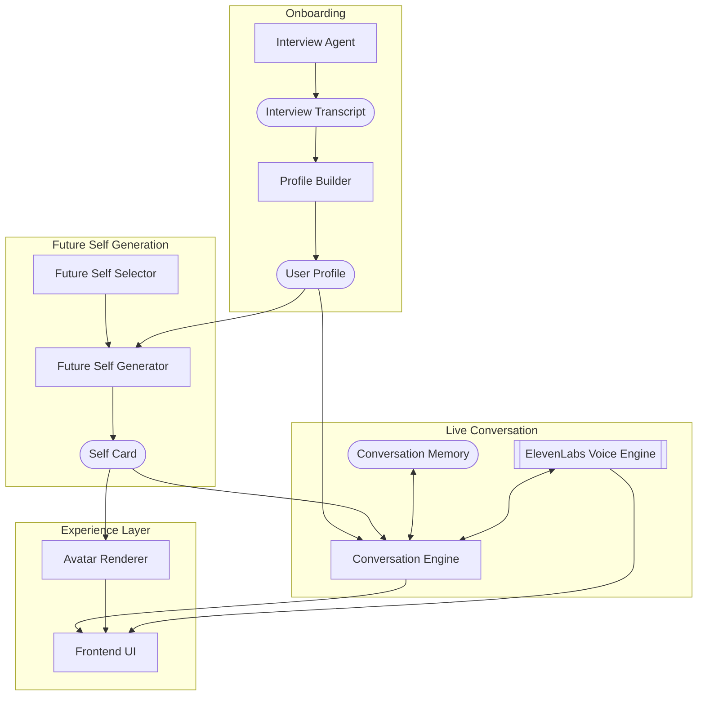

# Future Selves - System Structure

## Product Overview
The product is a voice-first AI experience where a user first goes through an impersonal onboarding interview with a neutral AI, which builds a structured user profile from their values, fears, tensions, decision style, and current dilemma.

From that profile, we generate future selves - for example an ambition self, peace self, or love self - each with its own tone, worldview, trade-offs, voice, and visual identity.

The user can then speak live with that future self through voice, with ElevenLabs as a priority for the voice layer.

For the hackathon, we want to focus heavily on UI polish, a strong onboarding flow, a memorable avatar, and one excellent voice interaction rather than multiple selves debating.

## Main User Flow
1. Landing page: short premium intro, CTA to begin.
2. Interview screen: neutral AI interviewer asks thoughtful questions in voice/text to extract the user's profile.
3. Profile: we create a structured summary of the user - core values, fears, tensions, and decision pattern. At that point the user is interacting with an avatar-like version of themselves.
4. Future self selection: user chooses one future branch (for now maybe 2-3 max, but even 1 is fine for MVP) and the avatar changes based on the choices/future self.
5. Conversation chamber: user speaks with the future self using voice, sees subtitles, avatar, and a strong visual interface.
6. Debrief screen: short summary of what this self optimizes for, what it sacrifices, and gains.

## Core System Modules
### Interview Agent
Neutral, impersonal AI that asks the onboarding questions. Its role is not to advise, but to extract information cleanly and intelligently.

### User Profile Builder
Takes the interview transcript and converts it into a structured profile: values, fears, hidden tensions, decision style, self-narrative, and current dilemma.

This is then used as a basis for the Future Self Generator so that they reflect the user and are related. The branching out into different future selves is created by the engine based on the current dilemma and other parameters that could vary and be impacted by the choice (think personal situation, work, location, etc).

### Future Self Generator
Creates one coherent current self from the user profile. This profile self has:
- a name / type
- an optimization goal
- a tone of voice
- a worldview
- a core belief
- a trade-off / sacrifice
- a visual style

### Voice Conversation Engine
Handles the real-time conversation:
- user voice input
- transcription
- Mistral response generation
- ElevenLabs voice synthesis
- subtitle rendering
- conversation memory update

### Memory / State Manager
Stores:
- interview transcript
- structured user profile
- selected future self card
- short conversation memory
- key extracted facts from the conversation and tree-like memory structure

### Avatar / Experience Layer
Strong UI layer with a stylized avatar, subtle animation, premium layout, waveform / glow, and a coherent visual identity for the selected self.

## Simple Architecture Description
The architecture is basically:

`User interview -> profile extraction -> future self generation -> live voice conversation -> final summary`

More explicitly:
- The user first talks to an Interview Agent.
- That interview is passed into a Profile Extraction Layer.
- The extracted profile is passed into a Future Self Generation Layer -> initial branching based on the dilemma and then parameter variation from the profile -> creates a persona.
- The generated self is then used by a Voice Conversation Layer with memory; some aspects of the memory should be shared between models.
- The result is rendered in a polished UI / Avatar layer.
- At the end we produce a Summary / Reflection screen (not a priority, but rather stating the different options that were explored).

## Architecture Diagram (Mermaid)

## Technical Structure (Simple)
### Frontend
- Next.js / React
- Tailwind for a premium polished UI
- Main screens:
  - Landing & Interview
  - Profile Reveal and dilemma
  - Future Self Select
  - Voice Conversation
  - Debrief

### Backend
- Node backend, mostly Python based, try object-oriented programming.
- Main endpoints could be:
  - `/interview/respond`
  - `/profile/build`
  - `/future-self/generate`
  - `/conversation/respond` with clean handoff between 11 labs and Mistral
  - `/conversation/summarize` + memory management

### Storage
- lightweight DB or JSON store
- save:
  - session in tree fashion where we do not lose data if going back up branches to modify and explore things
  - transcript
  - user profile
  - selected self
  - short-term memory

### LLM / API Layer
- Mistral for interview logic, profile building, and future self responses
- ElevenLabs for voice output
- optional later:
  - Hugging Face for orchestration / memory tools
  - W&B for evals (debate between multiple selves)

## MVP Priorities
For the hackathon, priority order should be:

1. Beautiful UI and avatar
2. Future self
3. Real voice conversation with ElevenLabs
4. Excellent onboarding interview
5. Strong profile generation
6. One very good future self

## What We Are Intentionally Not Prioritizing for Now
- debate between multiple selves
- complex multi-agent routing
- fine-tuning
- heavy infra
- too many branches (kee)

The goal is to make one highly polished voice-first experience that feels magical and memorable in demo.

## One-Line Pitch
Future Selves is a voice-first AI product where a neutral interviewer builds your identity profile, then lets you speak to a possible future version of yourself generated from that profile.

## More Technical Pitch
Future Selves starts with identity extraction rather than direct prompting: a neutral interview agent builds a structured user profile, then a future-self generation layer instantiates a coherent persona with its own voice, worldview, and memory for live spoken interaction.
