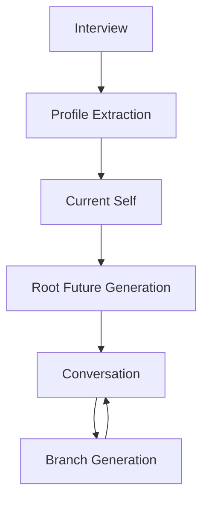

# Tomorrow You Architecture

## Product Summary
Tomorrow You is a voice-first decision exploration system:
1. A neutral onboarding interview collects user context.
2. The system builds a structured user profile and current-self card.
3. The system generates future-self branches.
4. The user converses with a selected future self.
5. The user can branch again from conversation context.

## End-to-End Flow
1. **Onboarding**: interview start/reply/status/complete
2. **Handoff**: completion generates `currentSelf`
3. **Exploration**: root future selves are generated
4. **Conversation**: user chats with one selected self
5. **Branching**: child futures generated from conversation transcript/context

## Runtime Components
- **Routers**: API endpoints and HTTP semantics
- **Engines**: generation, orchestration, context resolution, memory logic
- **Models**: schema contracts (profile, self cards, pipeline payloads)
- **Storage**: session + transcript + memory tree artifacts
- **Providers**: Mistral (LLM), ElevenLabs (voice), optional Gemini (avatar)

## Backend API Surface
- Onboarding: `/interview/*`
- Pipeline orchestration: `/pipeline/*`
- Future generation: `/future-self/*`
- Conversation: `/conversation/*`

## Data Model Highlights
- `userProfile`: structured values/fears/tensions and profile sections
- `currentSelf`: generated from completed onboarding
- `futureSelvesFull`: all generated futures (tree-preserving)
- `explorationPaths`: parent → children mapping
- transcript + memory nodes for branch context

## Design Priorities
- Keep onboarding quality high (clean extraction and dilemma clarity)
- Keep branch continuity (no data loss when exploring alternatives)
- Keep conversation coherent (use ancestor and transcript context)
- Keep UX simple (single clear path from onboarding to branching)

## Mermaid (High-Level)

```mermaid
flowchart TD
    A[Interview] --> B[Profile Extraction]
    B --> C[Current Self]
    C --> D[Root Future Generation]
    D --> E[Conversation]
    E --> F[Branch Generation]
    F --> E
```

## Quick Run
```bash
python backend/test_onboarding_live.py --mode interactive --streaming
```

In the CLI:
- `/complete` finalizes onboarding and auto-starts exploration
- `/use` selects the active future self
- `/branch` creates child futures from the current branch