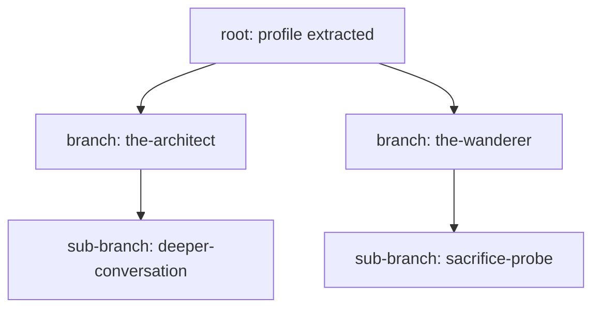

# Agent Infrastructure Map

This schematic is synthesized from:
- `backend/engines/README.md`
- `backend/routers/README.md`
- `backend/models/README.md`
- `storage/README.md`
- `prompts/README.md`
- `backend/config/README.md`
- `shared/README.md`
- `frontend/lib/README.md` and `frontend/screens/README.md`

## End-to-End Architecture (Mermaid)

```mermaid
flowchart LR
  %% Frontend
  subgraph FE[Frontend (Next.js)]
    SCREENS["Screens\nLanding -> Interview -> Profile -> Select -> Conversation -> Debrief"]
    API["lib/api.ts\nREST client"]
    WS["lib/websocket.ts\nWS client"]
    STORE["Zustand SessionStore"]
  end

  %% Backend
  subgraph BE[Backend (FastAPI)]
    ROUTERS["Routers\ninterview/profile/future_self/conversation/avatar"]
    SUM["Debrief Summary Flow"]

    subgraph ENGINES[AI Engines]
      IA["InterviewAgent"]
      PB["ProfileBuilder"]
      FSG["FutureSelfGenerator"]
      CE["ConversationEngine"]
      VP["VoicePipeline"]
      AG["AvatarGenerator"]
    end
  end

  %% Prompt layer
  subgraph PROMPTS[Prompt Templates]
    P_INT["interview.md"]
    P_PROF["profile_extraction.md"]
    P_FUT["future_self_generation.md"]
    P_CONV["conversation.md"]
    P_SUM["summarize.md"]
  end

  %% Data/state layer
  subgraph DATA[State, Contracts, and Persistence]
    SHARED["shared/ schemas\nUserProfile, SelfCard, Session,\nMemoryNode, MemoryBranch, TranscriptEntry"]
    MODELS["backend/models\nPydantic models"]
    SESSION["SessionStore + MemoryTree"]
    TRANSCRIPT["transcript.json\nlinear append-only log"]
    MEMORY["memory/nodes + branches.json\ngit-like branching memory"]
    AV_CACHE["avatars/*.png\navatar cache"]
  end

  %% External providers
  subgraph EXT[External AI Providers]
    MISTRAL["Mistral LLM"]
    EL_STT["ElevenLabs STT"]
    EL_TTS["ElevenLabs TTS"]
    PIXTRAL["Mistral Pixtral (avatar)"]
    GEMINI["Gemini (avatar fallback)"]
  end

  %% Client <-> API
  SCREENS --> API
  SCREENS --> WS
  STORE <--> SCREENS
  API --> ROUTERS
  WS --> ROUTERS

  %% Router -> engines
  ROUTERS --> IA
  ROUTERS --> PB
  ROUTERS --> FSG
  ROUTERS --> CE
  ROUTERS --> VP
  ROUTERS --> AG
  ROUTERS --> SUM

  %% Engine -> prompts
  IA --> P_INT
  PB --> P_PROF
  FSG --> P_FUT
  CE --> P_CONV
  SUM --> P_SUM

  %% Engine -> providers
  IA --> MISTRAL
  PB --> MISTRAL
  FSG --> MISTRAL
  CE --> MISTRAL
  VP --> EL_STT
  VP --> EL_TTS
  AG --> PIXTRAL
  AG -.fallback.-> GEMINI

  %% Contracts + storage
  SHARED --> MODELS
  MODELS --> ROUTERS
  ROUTERS <--> SESSION
  PB <--> SESSION
  FSG <--> SESSION
  CE <--> SESSION
  AG <--> SESSION

  SESSION --> TRANSCRIPT
  SESSION --> MEMORY
  SESSION --> AV_CACHE
```

## Memory Branching Model (Mermaid)



## Endpoint to Engine Map

| Endpoint | Router | Engine(s) | External Dependency |
|---|---|---|---|
| `POST /interview/respond` | `interview.py` | `InterviewAgent` | Mistral |
| `POST /interview/complete` | `interview.py` | (orchestration) | - |
| `POST /profile/build` | `profile.py` | `ProfileBuilder` | Mistral |
| `POST /future-self/generate` | `future_self.py` | `FutureSelfGenerator` | Mistral |
| `POST /future-self/select` | `future_self.py` | (session update) | - |
| `WS /conversation/stream` | `conversation.py` | `VoicePipeline` + `ConversationEngine` | ElevenLabs + Mistral |
| `POST /conversation/summarize` | `conversation.py` | (summary flow) | Mistral |
| `POST /conversation/backtrack` | `conversation.py` | `MemoryTree` operations | storage layer |
| `POST /avatar/generate` | `avatar.py` | `AvatarGenerator` | Pixtral or Gemini |
